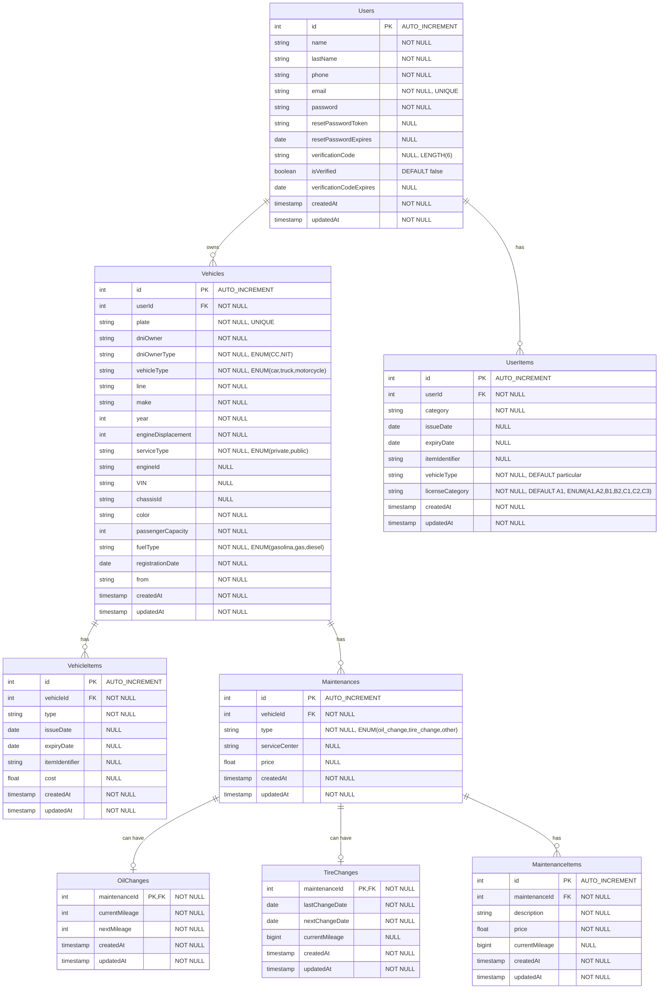

# Diagrama de Base de Datos - TuCarga API

Este documento contiene el diagrama de la estructura de la base de datos del proyecto TuCarga API, generado a partir de los modelos Sequelize.

## Diagrama ER (Entity Relationship)

## Descripción de Entidades

### Users (Usuarios)
- **Propósito**: Almacena la información de los usuarios del sistema
- **Campos principales**: name, lastName, phone, email, password
- **Características especiales**: 
  - Email único con validación
  - Password hasheado automáticamente
  - Sistema de verificación con código
  - Sistema de reset de contraseña

### Vehicles (Vehículos)
- **Propósito**: Almacena la información de los vehículos registrados por usuarios
- **Campos principales**: plate (placa única), make, year, vehicleType
- **Relaciones**: Pertenece a un Usuario, tiene muchos VehicleItems y Maintenances
- **Características especiales**:
  - Soporte para diferentes tipos de vehículo (car, truck, motorcycle)
  - Información técnica detallada (motor, combustible, capacidad)

### VehicleItems (Documentos del Vehículo)
- **Propósito**: Almacena documentos y elementos asociados a un vehículo
- **Campos principales**: type, issueDate, expiryDate, cost
- **Tipos comunes**: SOAT, seguro, revisión técnica, kit de carretera
- **Relación**: Pertenece a un Vehículo

### UserItems (Documentos del Usuario)
- **Propósito**: Almacena documentos personales del usuario (principalmente licencias)
- **Campos principales**: category, vehicleType, licenseCategory
- **Características especiales**: 
  - Categorías de licencia (A1, A2, B1, B2, C1, C2, C3)
  - Tipo de vehículo autorizado (particular, público)

### Maintenances (Mantenimientos)
- **Propósito**: Registro de mantenimientos realizados a los vehículos
- **Campos principales**: type, serviceCenter, price
- **Tipos**: oil_change, tire_change, other
- **Relaciones**: Pertenece a un Vehículo, puede tener OilChange, TireChange y MaintenanceItems

### OilChanges (Cambios de Aceite)
- **Propósito**: Detalles específicos de cambios de aceite
- **Campos principales**: currentMileage, nextMileage
- **Relación**: One-to-One con Maintenance (solo para mantenimientos tipo oil_change)

### TireChanges (Cambios de Llantas)
- **Propósito**: Detalles específicos de cambios de llantas
- **Campos principales**: lastChangeDate, nextChangeDate, currentMileage
- **Relación**: One-to-One con Maintenance (solo para mantenimientos tipo tire_change)

### MaintenanceItems (Elementos de Mantenimiento)
- **Propósito**: Detalles de elementos específicos en cualquier tipo de mantenimiento
- **Campos principales**: description, price, currentMileage
- **Relación**: Many-to-One con Maintenance

## Relaciones Principales

1. **Users → Vehicles**: Un usuario puede tener múltiples vehículos
2. **Users → UserItems**: Un usuario puede tener múltiples documentos/licencias
3. **Vehicles → VehicleItems**: Un vehículo puede tener múltiples documentos
4. **Vehicles → Maintenances**: Un vehículo puede tener múltiples mantenimientos
5. **Maintenances → OilChanges**: Un mantenimiento puede tener un cambio de aceite (1:1)
6. **Maintenances → TireChanges**: Un mantenimiento puede tener un cambio de llantas (1:1)
7. **Maintenances → MaintenanceItems**: Un mantenimiento puede tener múltiples elementos

## Notas Técnicas

- **Timestamps**: Todas las tablas incluyen createdAt y updatedAt automáticamente
- **Cascade**: Las eliminaciones en cadena están configuradas entre entidades relacionadas
- **Índices**: Los campos email (Users) y plate (Vehicles) tienen índices únicos
- **Validaciones**: Email validation en Users, enum constraints en varios campos
- **Mileage Tracking**: Se usa BIGINT para currentMileage para soportar valores grandes
